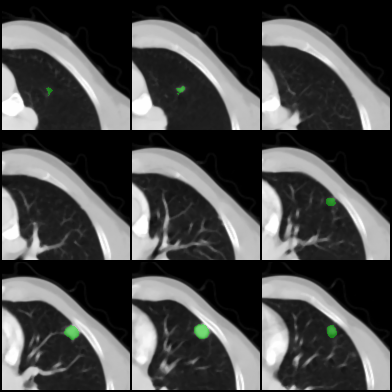
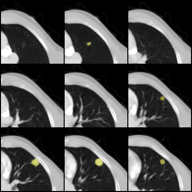

______________________________________________________________________

<div align="center">

# 3D Medical Image Segmentation

<a href="https://pytorch.org/get-started/locally/"></a>
<a href="https://pytorchlightning.ai/"></a>
<a href="https://hydra.cc/"></a>
<a href="https://github.com/ashleve/lightning-hydra-template"></a><br>
[](https://www.nature.com/articles/nature14539)
[](https://papers.nips.cc/paper/2020)

</div>

## Description

This repository provides a comprehensive approach to 3D medical image segmentation on the LIDC dataset (also supported: BTCV, BraTS), covering both model development and deployment. It includes:

#### Model Training:
- Training models from scratch: UNETR, SwinUNETR, nnUnet, 3D U-Net, ...
- Fine-tuning on existing models: STU-Net, SwinUNETR pre-trained, ...
- Leveraging foundation models to boost segmentation performance: SAM, SAM-MED3D.
 
#### Loss Functions:
- Implementation and evaluation of multiple loss functions specifically designed for medical image segmentation: BCE, Hybrid Focal, Combination Loss

#### Inference and Deployment:
- Inference pipeline designed for clinical usability.
- Integration with 3D Slicer and OHIF Viewer.
- Serving support via MONAI Label and Triton Inference Server for inference and visualization.
- Docker for containerization.

## Installation

#### Pip

```bash
# clone project
git clone https://github.com/minhminh2k/3D-SegClass-Medical
cd 3D-SegClass-Medical

# [OPTIONAL] create conda environment
conda create -n mis python=3.9
conda activate mis

# install pytorch according to instructions
# https://pytorch.org/get-started/

# install requirements
pip install -r requirements.txt
```

#### Conda

```bash
# clone project
git clone https://github.com/minhminh2k/3D-SegClass-Medical
cd 3D-SegClass-Medical

# create conda environment and install dependencies
conda env create -f environment.yaml -n mis

# activate conda environment
conda activate mis
```

## How to run

Train model with default configuration

```bash
# train on CPU
python src/train.py trainer=cpu

# train on GPU
python src/train.py trainer=gpu
```

Train model with chosen experiment configuration from [configs/experiment/](configs/experiment/)

```bash
python src/train.py experiment=experiment_name.yaml
```

You can override any parameter from command line like this

```bash
python src/train.py trainer.max_epochs=20 data.batch_size=1
```

## Deploy with Docker and Triton Inference Server

```
# Build Docker Compose
docker compose up --build -d

# Access to OHIF
OHIF Viewer: http://127.0.0.1:8003/ohif/

# Access to 3D Slicer
3D Slicer: Download the software and connect through the MonAI Label
```

- Export data to dcom viewer: ```sudo /home/lenovo/anaconda3/envs/mis/bin/python infers/convert_dcom.py```
- Upload data to dcom viewer: ```python infers/ImportDicomFiles.py localhost 8042 ./data/LIDC_Dcom/LIDC-IDRI-0001```
- Using MonAI Label to send request to Triton Inference Server.

## Experiment results

#### Summary of experimental results of models trained with Hybrid Focal Loss

| Model                          | DSC ↑ | IoU ↑ | HD ↓   |
|-------------------------------|-------|-------|--------|
| 3D U-Net               | 0.697 | 0.567 | 15.432 |
| nnUnet                    | 0.719 | 0.592 | 16.647 |
| UNETR                      | 0.710 | 0.578 | 13.923 |
| SwinUNETR                | 0.712 | 0.581 | 14.464 |
| UNETR++                   | 0.694 | 0.564 | **12.043** |
| SwinUNETR (pre-trained) | 0.700 | 0.568 | 15.483 |
| **STU-Net-B **            | **0.731** | **0.604** | 13.830 |
| SAM3D                     | 0.328 | 0.234 | 28.376 |
| SAM-Med3D + UNETR         | 0.690 | 0.562 | 18.431 |
| SAM-Med3D + nnUnet        | 0.711 | 0.583 | 16.181 |

#### Comparison of results between fine-tuning STU-Net-B with Hybrid Focal Loss and Combination Loss

| Loss Function      | DSC ↑ | IoU ↑ | HD ↓   |
|--------------------|-------|-------|--------|
| Hybrid Focal Loss  | 0.731 | 0.604 | 13.830 |
| **Combination Loss** | **0.740** | **0.605** | **13.272** |

#### Visualization of a segmentation case produced by the STU-Net model trained with Combination Loss
| Ground Truth | Prediction |
|--------------|------------|
|  |  |


#### Full Results and Visualization: [Wandb](https://wandb.ai/minhqd9112003/3d-segmentation)
